# Canada Wildfire Risk

[](https://github.com/KushPatel29/wildfire-prediction-app/actions/workflows/ci.yml)


[](https://wildfire-prediction-app1.streamlit.app)


Seven-day wildfire ignition risk for Canada, rebuilt twice a day from public data:
which 1° cells are most likely to report a new fire, and which are most likely to
report one that grows past 200 hectares.

It is the 2024 hackathon project this started as, taken from a yearly area-burned
regression to a daily, calibrated, out-of-time-tested forecast that runs on live
CWFIS observations and an Open-Meteo forecast — and that reports the seasons it got
wrong as plainly as the ones it got right.

**Live app:** [wildfire-prediction-app1.streamlit.app](https://wildfire-prediction-app1.streamlit.app)
— this week's forecast, the 2026 season check, a replay of any day in 2020–2024,
and the model card.

**Everything below is produced by a pipeline in this repository and asserted by a
test. No number is quoted that the code does not reproduce.**

---

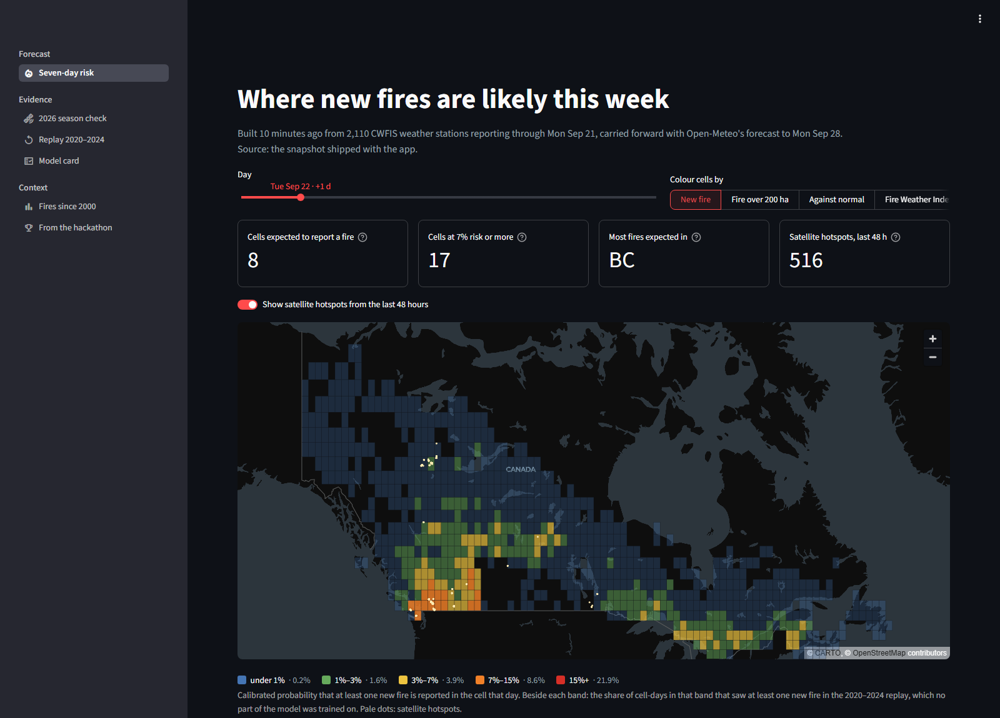

## What it scored on seasons it never saw

Trained on 2000–2016, early-stopped and calibrated on 2017–2019, then scored **once**
on 2020–2024. Two baselines stand next to it, because a model that cannot beat them
is not worth deploying: each cell's own fire rate for that month (learned from
training years only), and a logistic regression on FWI, ISI, BUI and month — roughly
what a fire-danger class table gives an agency today.

| 2020–2024, any new fire | ROC-AUC | PR-AUC | Fires in the riskiest 10% | Lift |
|---|---:|---:|---:|---:|
| **This model** | **0.881** | **0.196** | **65.8%** | **5.9×** |
| Normal for the month | 0.822 | 0.117 | 49.7% | 4.4× |
| FWI logistic regression | 0.736 | 0.064 | 35.0% | 3.1× |

| 2020–2024, a fire that grows past 200 ha | ROC-AUC | PR-AUC | Fires in the riskiest 10% | Lift |
|---|---:|---:|---:|---:|
| **This model** | **0.926** | **0.028** | **77.9%** | **7.6×** |
| Normal for the month | 0.710 | 0.006 | 23.0% | 2.2× |
| FWI logistic regression | 0.853 | 0.013 | 54.4% | 5.4× |

The operational number is the last one re-ranked daily: **rank the 753 cells fresh
every morning, take the riskiest 76, and 57.5% of the 27,147 fires reported in
2020–2024 started inside them.** Random cells would hold 10%. Ranking the whole test
period at once scores higher (65.8%) because it also rewards knowing July is busier
than April; both are reported, and which is which is stated on the page.

These are the numbers after a bug that had put 97.7% of fires in the wrong cell was
fixed on 22 September 2026 — before it, this table read 0.807 and 36.7%. What it was,
and why nothing broke, is the fifth item under
[Five things that would have been silently wrong](#five-things-that-would-have-been-silently-wrong).

Calibration is isotonic, fitted on the validation seasons. On the test seasons it
holds at the low end and runs a little high above about 2%: the decile the model
calls 0.9% reports a fire on 0.9% of days, the 1.5% decile on 1.4%, the 2.9% decile
on 2.5%, the 5.7% decile on 4.8%, and the riskiest tenth is over-confident - 16.5%
predicted against 14.9% observed - which the model card shows rather than smooths.
Brier 0.0214 against a 2.5% base rate.

Replaying 1 June 2023 — the day Quebec's lightning bust began. White rings are the
fires that were actually reported:

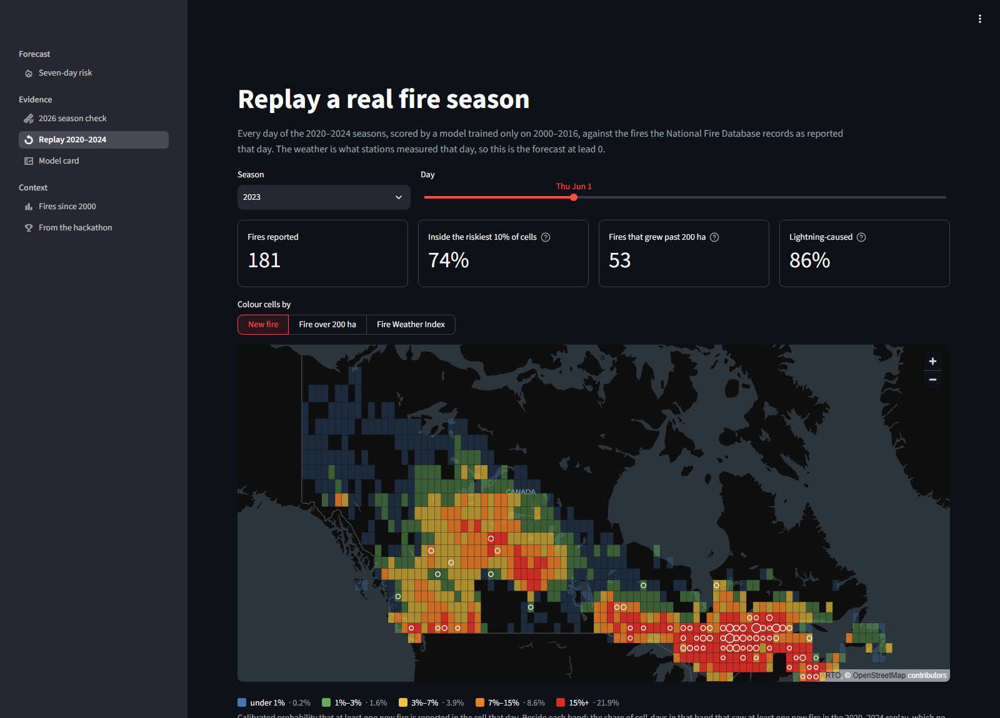

## The 2026 season, graded by satellite

The National Fire Database is published a season or more after the fact, so it
cannot grade 2026. CWFIS's satellite hotspot archive can. Every cell on every day
from 1 April to 21 September 2026 was scored from that day's station weather, and
checked against **new fire activity**: hotspots in a cell that had none in the
previous 14 days. 969 such cell-days out of 130,269.

| Ranking of 2026 satellite detections | ROC-AUC | New activity in the day's riskiest 10% |
|---|---:|---:|
| Large-fire model | **0.748** | **24.5%** |
| Any-fire model | 0.743 | 23.5% |
| FWI alone | 0.724 | 21.5% |
| Normal for the month | 0.630 | 16.2% |

**Both models beat the Fire Weather Index on this season, and by much less than
on the test seasons — which is worth saying rather than hiding.** A satellite sees
fires big and hot enough to detect from orbit, and those are the fires weather
drives, so the label favours the index. The any-fire model is trained on every
reported start, including the small human-caused fires near roads and towns that its
fire-history features exist to find and that satellites rarely see. Before the cell
bug was fixed, FWI alone beat the any-fire model here (0.719 against 0.692): this was
the one score the scrambled labels could not flatter, because it is graded against
satellites rather than against the same scrambled record, and it was the one the
model lost. The honest summary now is that on this season, against this label, the
model is a little ahead of the index, and both are far ahead of climatology.

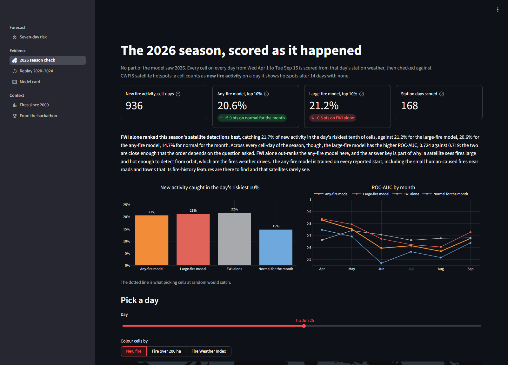

## What is in it

| | |
|---|---|
| Fires | 164,707 in the National Fire Database point layer, 2000–2024, prescribed burns excluded |
| Grid | 753 one-degree cells — every cell with at least ten fires in 2000–2016 |
| Weather | 3,198 CWFIS stations with the official FWI System codes |
| Rows | 4,028,550 cell-days over 25 fire seasons, 2.6% of which report a fire |
| Live sources | CWFIS station observations, CWFIS satellite hotspots, Open-Meteo forecast |

## The app

Six pages, all reading the same evidence files:

- **Seven-day risk** — the live map, coloured by the chance of a new fire, the chance
  of a large one, the day's risk against the cell's own normal, or the Fire Weather
  Index; satellite hotspots from the last 48 hours; the week by province; the
  riskiest cells with the weather behind them. A button rebuilds the whole forecast
  from live data in about three minutes.
- **2026 season check** — the table above, by month, with a map of any day.
- **Replay 2020–2024** — any day of the test seasons, the risk map against the fires
  that actually started, and the day the season's model did worst.
- **Model card** — every metric, the calibration curve, per-province scores, what the
  trees split on, and the limits.
- **Fires since 2000** — the record the model learns from.
- **From the hackathon** — what the original project was and what changed.

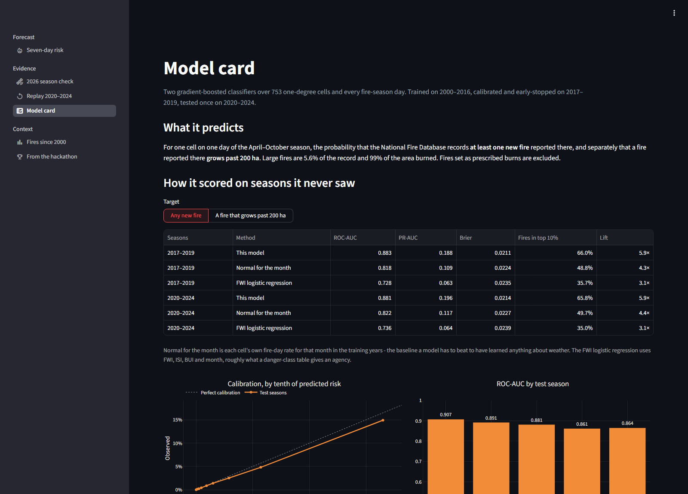

```bash
pip install -r requirements.txt
streamlit run app/streamlit_app.py
```

The app ships with a forecast snapshot, so it runs with no network. Given one, it
reads the newest forecast the scheduled GitHub Actions run published.

## The Power BI dashboard

The 2024 project was a Power BI dashboard. So is this one — eight pages over the
same evidence the app reads, generated rather than clicked together.

| Page | What it answers |
|---|---|
| Seven-day fire risk | Which cells are riskiest this week, and how that compares with normal |
| Canada's fires since 2000 | The record the model learned from, by year, cause, province and month |
| Out of time: 2020–2024 | What the ranking would have caught, day by day, on seasons it never saw |
| What it scored, and against what | ROC-AUC, PR-AUC and capture against both baselines, and the calibration curve |
| Where it works, and where it does not | Province by province, cell by cell, and what the trees split on |
| This season, graded by satellite | 2026 against CWFIS hotspots, with FWI alone as a competitor |
| The 2024 model, re-scored | The hackathon random forest, scored the way this repository scores everything |
| What the evidence says | The four headline numbers and the scoreboard, on one page |

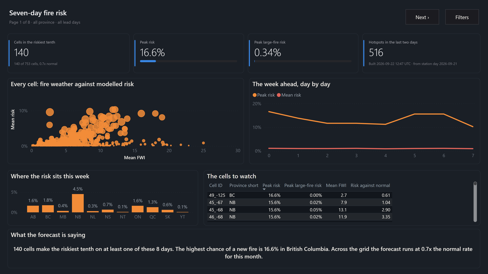

| | |
|---|---|
| 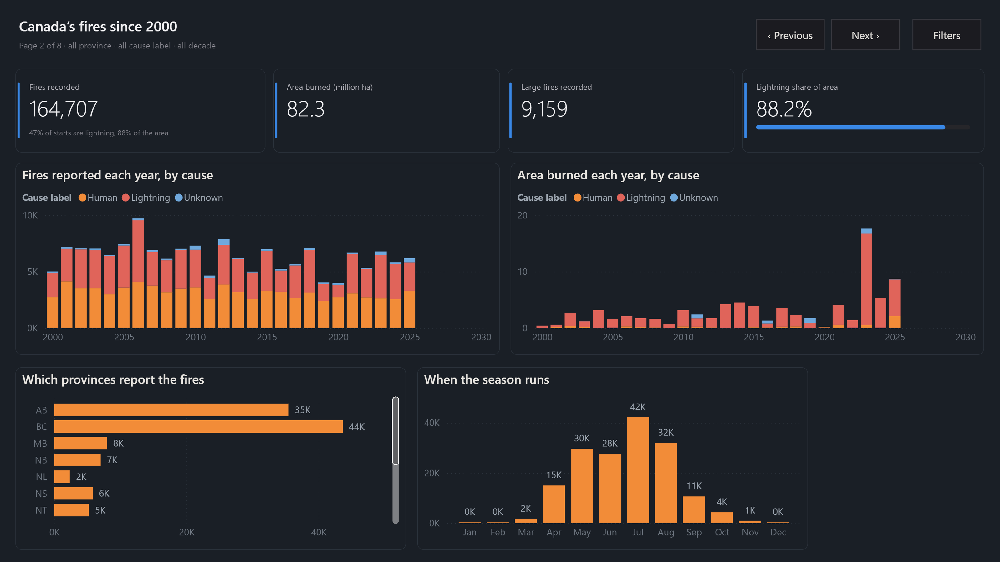 | 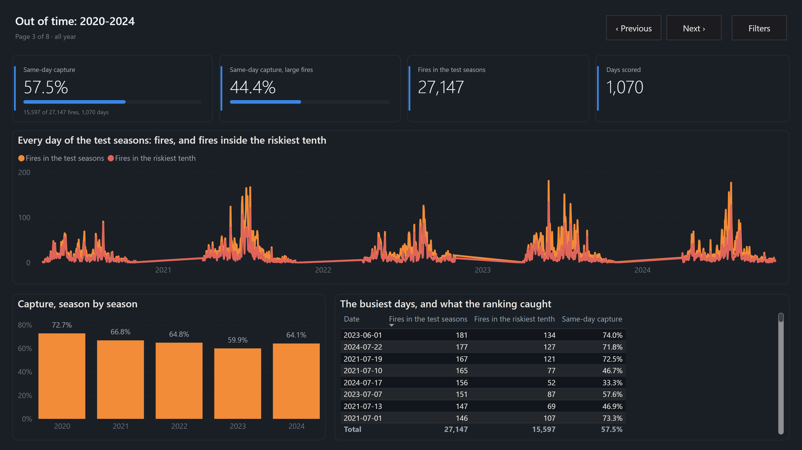 |
| 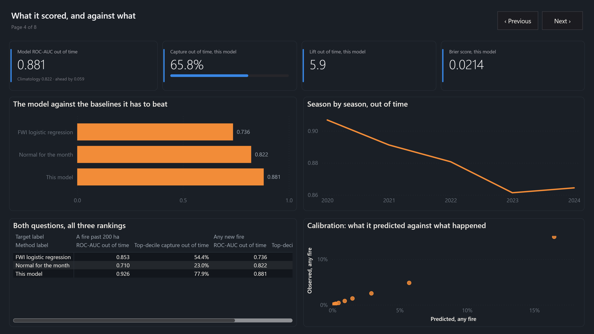 | 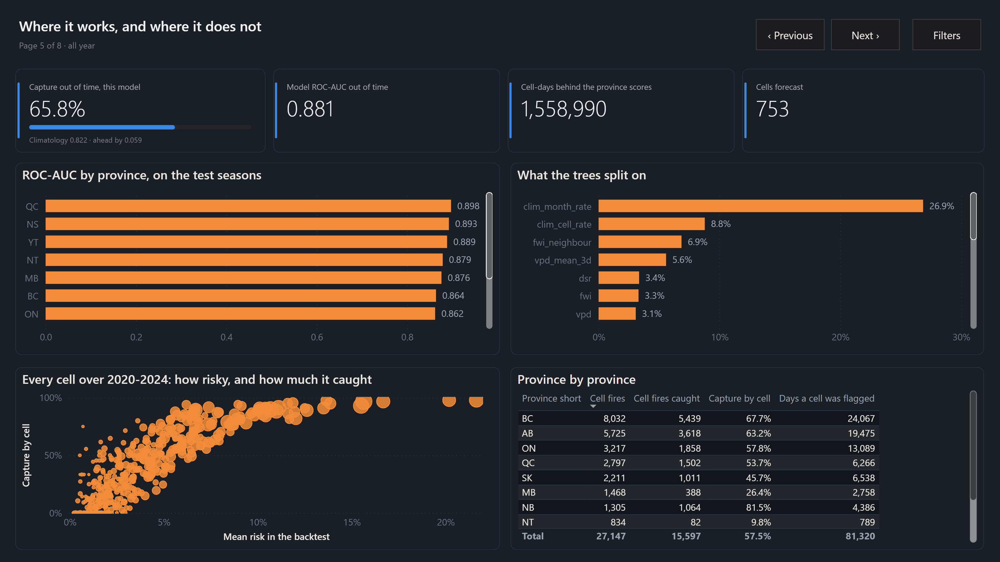 |
| 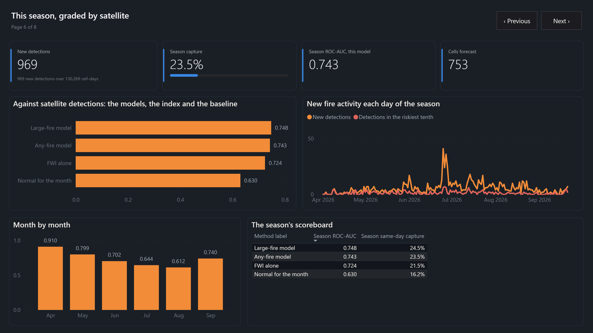 | 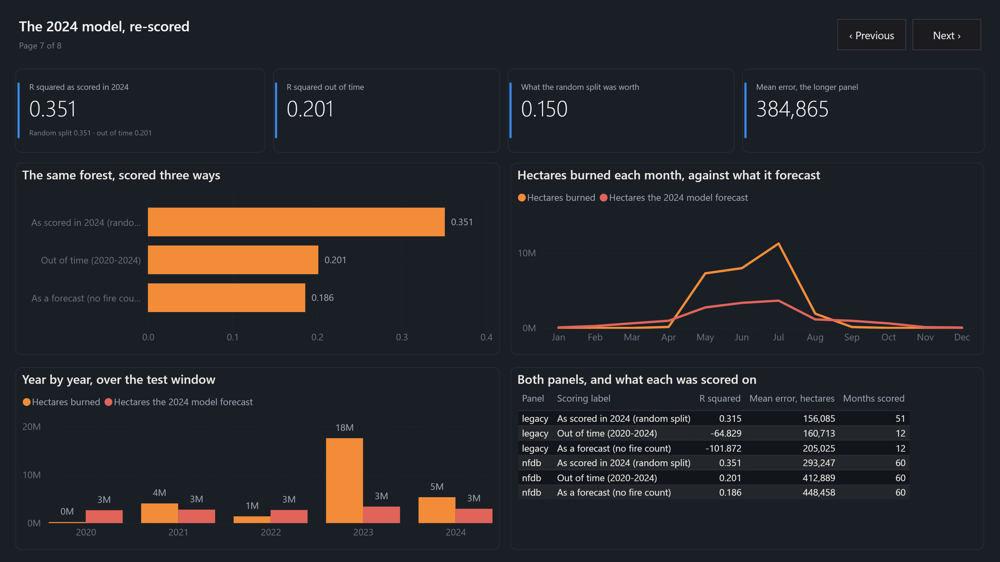 |

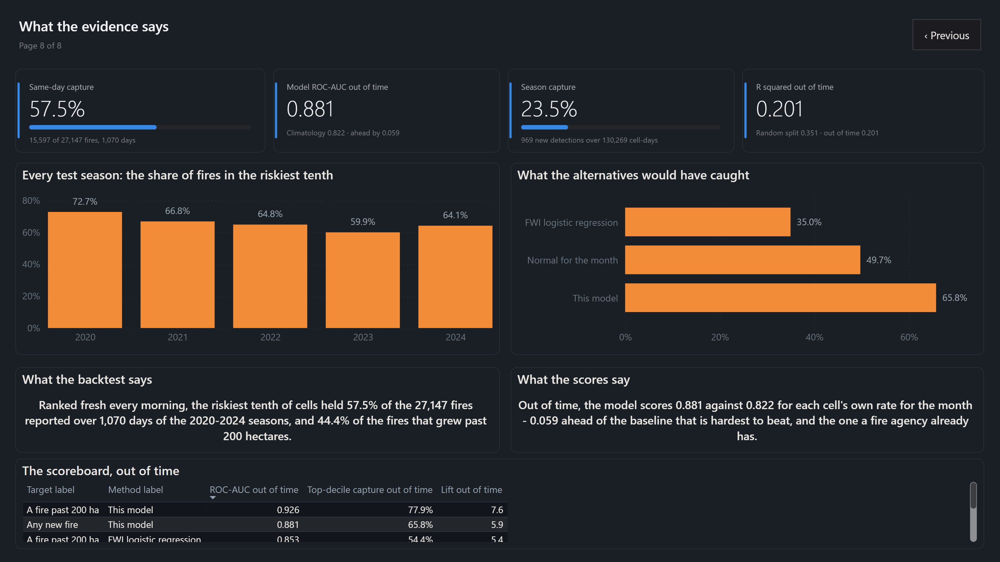

The semantic model (TMDL) and the report (PBIR) are **generated** from
[`powerbi/model_spec.py`](powerbi/model_spec.py) and
[`powerbi/report_spec.py`](powerbi/report_spec.py):

```bash
python pipelines/powerbi_export.py     # 22 CSVs, each an aggregate of published evidence
python -m powerbi.build_pbip           # write powerbi/pbip
python -m powerbi.build_pbip --check   # CI gate: the committed project matches the spec
```

Nothing on the dashboard recomputes a score. Every measure either aggregates a
column the Python engines already wrote or divides two of them, and
`tests/test_the_dashboard_shows_the_same_numbers.py` reconciles each exported
table against the file it came from — so the 57.5% on the dashboard's final page
is the same 57.5% as the app's, the README's and `reports/metrics.json`.

The screenshots above were exported from Power BI Desktop on 24 September 2026, after a full refresh against the current evidence (753 cells, ROC-AUC 0.881, 57.5% same-day capture).

Three things this found that Power BI reports as something else entirely: an
apostrophe in a measure name (`Share of the trees' gain`) fails as *"Invalid
indentation was detected"* and the project will not open; a month abbreviation
typed as a date makes every row of the calendar an error with nothing on the
canvas to say so; and a hotspot timestamp typed as a date matches no day in the
date table, leaving a relationship that exists and filters nothing. All three are
now tests.

## How it works

**The unit of prediction** is a 1° cell on one day of the April–October season — about
110 km by 70 km, coarse enough for the station network to describe and fine enough
to put crews against. 98% of Canada's recorded fires start in those months, and the
5.6% that grow past 200 ha account for 99% of the area burned.

**Fire weather.** `src/wildfire/fwi.py` implements the Canadian Forest Fire Weather
Index System (Van Wagner 1987): FFMC, DMC, DC, ISI, BUI, FWI and the Daily Severity
Rating. It is not trusted because it looks right — `tests/test_fwi.py` replays real
station seasons through it from their official starting codes and requires the
result to track CWFIS's published values (FFMC within 0.5, DC within 2, FWI within 1).
The same implementation runs in training and in the live forecast, so a forecast day
and a training day are built by the same arithmetic.

**From stations to cells.** Each cell takes an inverse-distance-weighted average of
up to four stations within 200 km, variable by variable, so a station reporting
temperature but no codes still informs temperature. A cell with none in range gets
NaN, which the model reads as "unobserved" rather than as zero.

**Features (42).** The day's weather and codes; vapour pressure deficit, which is
what temperature and humidity mean together; 3- to 30-day windows of FWI, humidity,
drought and rain; days since rain; the week's change in Drought Code; **today against
this cell's own normal for the month** and **against its neighbours the same day**,
because an FWI of 20 is an ordinary July in the southern interior and the driest week
of the decade on the Labrador coast; season, weekday, position, the cell's lightning
share, its normal fire rate for the month, and how far the nearest reporting station
is.

**Model.** Two boosters read as one number. A classifier asks whether the cell
reports a fire; a Poisson model of how many reads as `1 - exp(-lambda)`. On the
validation seasons their average puts 55.45% of fires inside the day's riskiest
tenth, the count model alone 55.41% and the classifier alone 54.86%: the average is
kept because it is never worse, not because it is much better. It is what gets
isotonically calibrated, so the published number is still a probability. XGBoost,
histogram trees, depth 12, learning rate 0.03, early stopping on the validation
seasons; twelve configurations were compared there and the test seasons were scored
once, afterwards. Those configurations were compared before the cell bug was fixed
and were not re-tuned after it, so the test seasons are still unseen. Split by season, never by row: a random split would put
a July day in training and the next July day in test, and the weather they share
would flatter every score.

**Live.** The last 30 days of CWFIS station files supply the starting codes and the
rolling features; Open-Meteo's forecast for each cell centre steps the codes forward
one day at a time; the same 42 features are assembled and scored.

## Five things that would have been silently wrong

Each of these produced a plausible number, and each is now a test.

1. **The booster was predicting with trees the calibration had never seen.** Early
   stopping keeps 100 rounds past the best iteration. XGBoost's scikit-learn wrapper
   predicts with the trees up to the best round — a bare `Booster.predict` uses all
   of them. Scoring with every tree moved probabilities by up to 0.15 against a
   calibration fitted on the best round.
2. **"The top 10%" was 10.8% of cells, and up to 14.4% on some days.** Isotonic
   calibration outputs plateaus, so `score >= quantile(0.9)` swept in every cell tied
   at the cut — and flattered whichever ranking had the biggest plateau there. Taking
   exactly the top tenth, ties broken by the uncalibrated score, moved same-day
   capture from 37.9% to 36.7% (both on the scrambled cells of item 5).
3. **A partly published station file restarted the drought codes.** CWFIS posts a
   day's file while stations are still reporting; the file for 15 September 2026 held
   1,110 of about 2,100 stations, leaving 30% of cells with no station in range and
   starting them from spring default codes. The mean Drought Code fell from 296 to
   212 overnight. The forecast now starts from the latest *complete* day.
4. **The hotspot map showed Idaho and Montana.** CWFIS's hotspot file covers North
   America; a latitude-longitude box around Canada keeps the northern United States.
   It is filtered against an outline now.
5. **97.7% of fires were in another fire's cell.** `clean_fires` drops the database
   rows it cannot use — bad dates, prescribed burns — and then gave each fire its cell
   from a list numbered from zero. The filtered table still carried the file's own row
   numbers, pandas lined the two up by number, and from the first dropped row onward
   every fire took the cell of a fire further down the file: 433,822 of 443,999.
   Nothing broke. The model trained, calibrated and scored 0.807 against the same
   scrambled record, and the one score it could not fake, against satellites, was the
   one where FWI alone beat it. A map of the grid's provinces gave it away: Nova
   Scotia's fires were in the Yukon. With every fire in its own cell the grid is 753
   cells, and the model scores 0.881 out of time and puts 57.5% of fires in the day's
   riskiest tenth.

## Reproduce it

```bash
pip install -r requirements-dev.txt

python pipelines/build_table.py     # NFDB + CWFIS archives -> 4.0M cell-days   (slow, downloads)
python pipelines/train.py           # fit, calibrate, evaluate -> models/, reports/metrics.json
python pipelines/publish.py         # the evidence the app reads -> data/published/
python pipelines/season_check.py    # this season against satellite hotspots
python pipelines/forecast.py        # today's seven-day forecast -> data/live/

pytest -q
```

`python pipelines/train.py --evaluate-only` re-scores the saved models without
refitting, which is how the published metrics and the app are kept on the same code
path.

## Deploying

The app runs on Streamlit Community Cloud at <https://wildfire-prediction-app1.streamlit.app>, on **Python 3.12** (set
it in Advanced settings before deploying; the default is newer than the pinned
scientific stack). Main file `app/streamlit_app.py`. The subdomain carries a `1`
because `wildfire-prediction-app` was already taken by someone else's app, and
Community Cloud subdomains are global.

`.github/workflows/forecast.yml` rebuilds the forecast twice a day and attaches
`forecast.parquet`, `hotspots.parquet` and `meta.json` to the `live-forecast`
release; the app reads them from there and falls back to the snapshot in
`data/live/`. GitHub disables scheduled workflows on a public repository after 60
days without commits, so the fallback matters.

## Limits

- **Lightning is not an input.** It starts most of the area burned in Canada. The
  model knows which cells tend to get lightning fires, not where today's storms are.
  The worst day in the 2023 replay is a lightning bust.
- **The cell's own history is the largest single input** — 27% of the trees' gain is
  the cell's normal rate for the month, 9% its rate over the season. Weather moves
  the answer around a strong prior; it does not replace it.
- **Report date, not ignition date.** A fire that smoulders before it is found is
  labelled on the day it was reported.
- **Coarse cells and thin northern coverage.** Where the nearest station is hundreds
  of kilometres away the codes are interpolated from far off, and the model leans on
  history instead.
- **Not an official product.** This is not the Canadian Forest Fire Danger Rating
  System. For decisions, follow [CWFIS](https://cwfis.cfs.nrcan.gc.ca/) and your
  provincial or territorial wildfire service.

## Layout

```
app/                 Streamlit app: streamlit_app.py + shared.py + views/
src/wildfire/        fwi.py, features.py, model.py, evaluation.py, live.py, forecast.py
pipelines/           build_table.py, train.py, publish.py, season_check.py, forecast.py
models/              boosters, isotonic calibrations, the grid, climatology, stations
data/published/      fire history, the 2020-2024 replay, the 2026 season check
data/live/           the forecast snapshot shipped with the app
reports/metrics.json every figure the model card shows
legacy/2024-hackathon/  the original notebooks, .pbix, deck and source tables
tests/               FWI against CWFIS, features, the live assembly, the evidence, every page
```

## Sources and licence

Fire records: **Canadian National Fire Database (NFDB)**, Natural Resources Canada.
Station weather, FWI System codes and satellite hotspots: **Canadian Wildland Fire
Information System (CWFIS)**. Contains information licensed under the
[Open Government Licence – Canada](https://open.canada.ca/en/open-government-licence-canada).
Forecast weather by [Open-Meteo.com](https://open-meteo.com/), CC BY 4.0.

Code: MIT.

## Where it started, and what re-scoring it showed

**Wildfire Prevention Strategy Using Technology**, the first-prize project of team
1904 Coders — Mrityunjay Gupta, Siddharth Alashi and Kush Patel — at a 2024
hackathon: a Power BI dashboard over the National Forestry Database's summary
tables, a random forest on area burned, and a DHT22/LM393 sensor prototype feeding a
Django service. The originals are kept unchanged in
[`legacy/2024-hackathon/`](legacy/2024-hackathon/).

`pipelines/hackathon_2024.py` rebuilds that random forest — the same 1,200 trees at
depth 20, the same eight features, the same target of hectares burned in a month
nationally — and changes only how it is scored.

| The 2024 model, scored | R² | Mean error | Months |
|---|---:|---:|---:|
| As it was scored in 2024 — random 80/20 split over months | **+0.351** | 293,247 ha | 60 |
| Out of time — fit to 2016, scored on 2020–2024 | **+0.201** | 412,889 ha | 60 |
| As a forecast — out of time, without the month's own fire count | **+0.186** | 448,458 ha | 60 |

Splitting months at random puts June 2015 in training and June 2016 in the hold-out,
and a fire season is strongly autocorrelated, so the first number measures
interpolation into a year the model has already seen. The feature it leans on
hardest — the count of fires in the month — is not knowable until that month is
over. Neither observation makes the 2024 project wrong; both are why this one asks a
different question, on cells and days, against baselines, on seasons held out in
time. The app's last page shows the same comparison.

The original weather series (`Weather_area.csv`) is not in the repository, so the
rebuild joins CWFIS station archives instead: the same monthly shape from a
different source, stated rather than implied.
